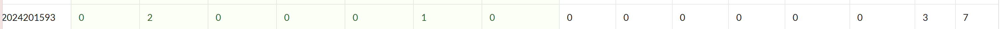

# bomblab 报告

姓名：陈子丹

学号：2024201593

| 总分 | phase_1 | phase_2 | phase_3 | phase_4 | phase_5 | phase_6 | secret_phase |
| --------- | ------------- | ------------- | ------------- | ----------------- |-----------|-----------|-----------|
| 7        | 1            | 1            | 1            | 1 |1  |1  |1  |


scoreboard 截图：



<!-- TODO: 用一个scoreboard的截图，本地图片，放到 imgs 文件夹下，不要用这个 github，pandoc 解析可能有问题 -->

## 解题报告

<!-- 对你拆掉的每个phase进行分析，并写出你得出答案的历程 -->

<!-- 如果能用伪代码还原题目源代码最佳（不属于先前提到的大段代码），语言描述自己的分析也可，每道题目的图片不建议超过两张 -->

### phase_1

```c
If abstraction is the definition of beauty, are those of us chasing after clarity a representation of ugly?
```
这道题比较简单，call调用strings_not_equal函数，用来比较，为了获得答案，需要使用x/s $rsi，若字符串相同，炸弹不会爆炸

### phase_2

```c
349703  719796  252009  471328
```
用python大概表示就是
```python
def phase_2(input_str):
    #sscanf读取4个整数，对应147d-1489逻辑
    try:
        inputs = list(map(int, input_str.split()))
    except ValueError:
        explode_bomb()
    
    #检查输入数量是否为4:cmp $0x4,%eax 逻辑
    if len(inputs) != 4:
        explode_bomb()
    
    #matA和matB
    matA = []
    matB = []
    
    #矩阵乘法运算
    result = []
    for row in matA:
        sum_val = 0
        for i in range(3):
            sum_val += row[i] * matB[i][0]
        result.append(sum_val)
    
    #比较输入与结果
    for input_val, target_val in zip(inputs, result):
        if input_val != target_val:
            explode_bomb()
    
    print(1)
```
这道题就是获得AB两个矩阵后，对其进行矩阵的乘法，得到结果。这道题我炸了两次，主要是在数的表示上没有分清。

### phase_3
```c
5 -429
```
用python表示大致思路：
```python
def phase_3(input_str):
    try:
        parts = input_str.strip().split()
        if len(parts) != 3:
            explode_bomb()
        idx = int(parts[0])
        char = parts[1]
        val = int(parts[2])
        # 校验字符为单个字符
        if len(char) != 1:
            explode_bomb()
    except (ValueError, IndexError):
        explode_bomb()
    
    #第一个整数 idx 不能大于7
    if idx > 7:
        explode_bomb()
    
    #跳转表
    answer_char = None
    answer_val = None
    mask = 0x20
    
    if idx == 0:
        answer_char = 0x76
        answer_val = 0xfc
    elif idx == 1:
        answer_char = 0x76
        answer_val = 0xfc
    else:
        explode_bomb()
    
    xor_char = ord(char) ^ mask
    if xor_char != answer_char:
        explode_bomb()
    
    if val != answer_val:
        explode_bomb()
    
    print(1)
```
通过 p/x $eax 获得mask值，cmpl检查输入整数是否大于7，如果大于7直接爆炸，否则根据第一个输入的值简介跳转。然后会检查第三个整数input_val2是否等于0xfc，252 15b5: je 169c，如果相等，会到最后比较的环节，如果相等，就不爆炸。

### phase_4
```c
31 CA
```
首先整数部分要等于func4_1(5) 的返回值，只需要根据要求递归：返回结果为 2 * 递归结果 + 1。func4_2首先要保证字符串长度为2，否则触发炸弹，用python大概表示为：
```python
def func4_1(n):
    if n <= 0:
        return 0
    if n == 1:
        return 1
    return 2 * func4_1(n - 1) + 1

def func4_2(n, target, start, end, aux, buffer):
    if n == 1:
        # n=1 时直接写入 start 和 end 到缓冲区
        buffer.append(chr(start))
        buffer.append(chr(end))
        return
    # 计算 limit = func4_1(n-1)
    limit = func4_1(n - 1)
    if target <= limit:
        #(start, aux, end)
        func4_2(n - 1, target, start, aux, end, buffer)
    elif target == limit + 1:
        #start\end
        buffer.append(chr(start))
        buffer.append(chr(end))
        return
    else:
        #(aux, end, start)
        new_target = target - limit - 1
        func4_2(n - 1, new_target, aux, end, start, buffer)

def phase_4(input_str):
    try:
        parts = input_str.strip().split()
        if len(parts) != 2:
            explode_bomb()
        input_int = int(parts[0])
        input_str = parts[1]
    except (ValueError, IndexError):
        explode_bomb()
    
    target_int = func4_1(5)
    if input_int != target_int:
        explode_bomb()
    
    #验证字符串长度为2
    if len(input_str) != 2:
        explode_bomb()
    
    #
    buffer = []
    # edi=5, esi=0x16(22), edx=0x41('A'), ecx=0x43('C'), r8d=0x42('B'), r9=buffer
    func4_2(n=5, target=22, start=65, end=67, aux=66, buffer=buffer)
    target_str = ''.join(buffer)
    
    if input_str != target_str:
        explode_bomb()
    
    print(1)
```
这道题很有意思，虽然不难，但是特别符合我眼缘，刚开始把汇编理解错了，所以递归一直不对。但是我知道是ABC的字符串，所以在尝试+理解下，很快就能得到答案。

### phase_5
```c
>74598
```
```python
def phase_5(input_str):
    if len(input_str) != 6:
        explode_bomb()
    
    target_array = []
    
    target_str =
    result = []
    for char in input_str:
        char_ascii = ord(char)
        index = (char_ascii + 0xf) & 0xf
        result_char = chr(target_array[index])
        result.append(result_char)
    
    if ''.join(result) != target_str:
        explode_bomb()
```
首先，必须是长度为6的字符串，对于每一个字符，先取字符的ASCII码，加 0xf 后与 0xf 按位与，用得到的索引去固定数组中取值，最终生成的字符串需与程序预设的目标字符串一致，那么炸弹就不会爆炸。

### phase_6
```c
6 1 3 2 4 5 defuse
```
这道题的关键就是获得他们的值，有一个节点并不相连，造成了一点点困扰，但是后面解决了。
```Breakpoint 6, 0x000055555555583d in phase_6 ()
(gdb) set $node_head = 0x55555555A210
(gdb) set $cur = $node_head
(gdb) set $n = 1
(gdb) while $n <= 6
 >printf "节点%d | 地址=0x%lx | 数值(val)=%d\n", $n, $cur, *(int*)$cur
 >set $next = *(long*)($cur + 8)
 >if $next == 0
  >break
  >end
 >set $cur = $next
 >set $n = $n + 1
 >end
节点1 | 地址=0x55555555a210 | 数值(val)=777
节点2 | 地址=0x55555555a220 | 数值(val)=73
节点3 | 地址=0x55555555a230 | 数值(val)=371
节点4 | 地址=0x55555555a240 | 数值(val)=570
节点5 | 地址=0x55555555a250 | 数值(val)=531
节点6 | 地址=0x55555555a160 | 数值(val)=610
```
得到节点数值之后，进行排序，由大到小，然后对应顺序再和7运算。

### secret phase
```c

```
这道题逻辑很复杂，需要自己考虑，
首先获得，
0x55555555a1a0 <row0>:  0x0000010000010000      0x000055555555a1b0
0x55555555a1b0 <row1>:  0x0100000001000000      0x000055555555a1c0
0x55555555a1c0 <row2>:  0x0000010000010001      0x000055555555a1d0
0x55555555a1d0 <row3>:  0x0000000000000001      0x000055555555a1e0
0x55555555a1e0 <row4>:  0x0001000100000100      0x000055555555a1f0
0x55555555a1f0 <row5>:  0x0000000101000001      0x000055555555a200
0x55555555a200 <row6>:  0x0100010000000000      0x000055555555a150
0x55555555a150 <row7>:  0x0000000000000100      0x0000000000000000
翻译后可以得到，
 [0,0,1,0,0,1,0,0],  # row0 (行0)
    [0,0,0,1,0,0,0,1],  # row1 (行1)
    [1,0,1,0,0,1,0,0],  # row2 (行2)
    [1,0,0,0,0,0,0,0],  # row3 (行3)
    [0,1,0,0,1,0,1,0],  # row4 (行4)
    [1,0,0,1,1,0,0,0],  # row5 (行5)
    [0,0,0,0,0,1,0,1],  # row6 (行6)
    [0,1,0,0,0,0,0,0],  # row7 (行7)
然后通过
(gdb) print *(int[8]*)($rsp)
$5 = {-2, -1, 1, 2, 2, 1, -1, -2}
(gdb) print *(int[8]*)($rsp+0x20)
$6 = {1, 2, 2, 1, -1, -2, -2, -1}
(gdb) print *(int[8]*)($rsp+0x40)
$7 = {-1, 0, 0, 1, 1, 0, 0, -1}
(gdb) print *(int[8]*)($rsp+0x60)
$8 = {0, 1, 1, 0, 0, -1, -1, 0}获得走棋盘的步骤（马字），且有预走路限制，这是很经典的编程，
1. 读取字符，取低3位得到idx 
2. 计算临时坐标 = (esi+C[idx], edx+D[idx]) 
3. 检查临时坐标是否为墙（值为1则失败） 
4. 计算新坐标 = (esi+A[idx], edx+B[idx]) 
5. 检查新坐标是否为墙（值为1则失败） （由于我在外围添加了1，无需检查边界）
7. 如果都通过，移动到新坐标20步内到达（4，7）

所以我写了一个python代码
```python
from collections import deque

# 定义地图（1=墙，0=可通行）
map_grid = [
    [1, 1, 1, 1, 1, 1, 1, 1, 1, 1],  # 行0
    [1, 0, 0, 1, 0, 0, 1, 0, 0, 1],  # 行1
    [1, 0, 0, 0, 1, 0, 0, 0, 1, 1],  # 行2
    [1, 1, 0, 1, 0, 0, 1, 0, 0, 1],  # 行3
    [1, 1, 0, 0, 0, 0, 0, 0, 0, 1],  # 行4
    [1, 0, 1, 0, 0, 1, 0, 1, 0, 1],  # 行5（目的地行5，列8）
    [1, 1, 0, 0, 1, 1, 0, 0, 0, 1],  # 行6
    [1, 0, 0, 0, 0, 0, 1, 0, 1, 1],  # 行7
    [1, 0, 1, 0, 0, 0, 0, 0, 0, 1],  # 行8
    [1, 1, 1, 1, 1, 1, 1, 1, 1, 1]  # 行9
]


A = [-2, -1, 1, 2, 2, 1, -1, -2]
B = [1, 2, 2, 1, -1, -2, -2, -1]
C = [-1, 0, 0, 1, 1, 0, 0, -1]
D = [0, 1, 1, 0, 0, -1, -1, 0]

# 目的地坐标
DEST_ESI = 5
DEST_EDX = 8

# 数字串最大长度（<20）
MAX_LENGTH = 19


def find_valid_number_string():
    """
    寻找符合条件的数字串：从(1,1)出发，按规则移动到(5,8)，长度<20
    """
    # 初始化BFS队列：(当前esi, 当前edx, 数字串)
    queue = deque()
    queue.append((1, 1, ""))

    # 记录已访问的坐标，避免重复处理
    visited = set()
    visited.add((1, 1))

    while queue:
        current_esi, current_edx, num_str = queue.popleft()

        # 数字串长度达到上限，跳过
        if len(num_str) >= MAX_LENGTH:
            continue

        # 尝试所有可能的数字（0-7，对应A/B/C/D的索引）
        for i in range(8):
            # 步骤1：计算临时坐标并检查是否为墙
            temp_esi = current_esi + C[i]
            temp_edx = current_edx + D[i]
            # 检查临时坐标是否在地图范围内且非墙
            # if not (0 <= temp_esi < 10 and 0 <= temp_edx < 10):
            #     continue  # 超出地图范围，无效
            if map_grid[temp_esi][temp_edx] == 1:
                continue  # 临时坐标是墙，失败

            # 步骤2：计算新坐标并检查是否为墙
            new_esi = current_esi + A[i]
            new_edx = current_edx + B[i]
            # 检查新坐标是否在地图范围内且非墙
            # if not (0 <= new_esi < 10 and 0 <= new_edx < 10):
            #     continue
            if map_grid[new_esi][new_edx] == 1:
                continue

            # 生成新数字串
            new_num_str = num_str + str(i)

            # 检查是否到达目的地
            if new_esi == DEST_ESI and new_edx == DEST_EDX:
                return new_num_str

            # 未访问过的坐标，加入队列
            if (new_esi, new_edx) not in visited:
                visited.add((new_esi, new_edx))
                queue.append((new_esi, new_edx, new_num_str))

    # 未找到符合条件的数字串
    return "未找到长度<20的有效数字串"


# 执行函数并输出结果
if __name__ == "__main__":
    result = find_valid_number_string()
    print(f"符合条件的数字串：{result}")
``` 
获得答案33022，但是炸弹还会炸，没有找到原因。
找到答案了，通过一步一步跟，就是33022，之前一直显示错误是txt的问题，不是答案的问题。过了还是很高兴的，不管怎样。

## 反馈/收获/感悟/总结

<!-- 这一节，你可以简单描述你在这个 lab 上花费的时间/你认为的难度/你认为不合理的地方/你认为有趣的地方 -->

<!-- 或者是收获/感悟/总结 -->

<!-- 200 字以内，可以不写 -->
前6个phase断断续续写了大概8个小时，但是最后一个secret_phase大概花了我周三一个下午晚上和周四一个晚上的时间（在我换脑子决定提前写报告的时候尚未解决），我想，如果这几天没有准备英语演讲周六没有六级考试的话，我会更有耐心做题，反而可能会思路更通顺一些。
解决secret phase是在一个平静汹涌的00：49分，我看到了horse gallops的消息，一直以来，并不是答案的错误，而是txt本身可能存在问题，我想，对我的启示，除了要少生气以外，还有多想想出错的方面有可能在哪里，并不只是答案可能出错，还有格式的问题………但是答案没错困扰了我从周四到周二我还是很冤枉啊啊啊啊还是会生闷气啊啊啊啊我甚至骚扰了助教好几天啊啊啊啊对不起助教师兄！！！！！
虽然我完全赞同爆炸扣分的设置，但我觉得可以允许1次爆炸的失误，没有什么原因，就是单纯因为我的炸弹炸了，是这样的。虽然有break的设置，但是在获得答案途中设置多个断点，很有可能一不小心就炸掉了，会让人很生气！很生气！不过确实也是个人的原因。
还是要感谢助教师兄师姐们，bomblab很好玩，虽然很崩溃，但是抛开一切不谈（），还是很好玩的。
## 参考的重要资料

<!-- 有哪些文章/论文/PPT/课本对你的实现有重要启发或者帮助，或者是你直接引用了某个方法 -->

<!-- 请附上文章标题和可访问的网页路径 -->
lhy师兄的bomblab report